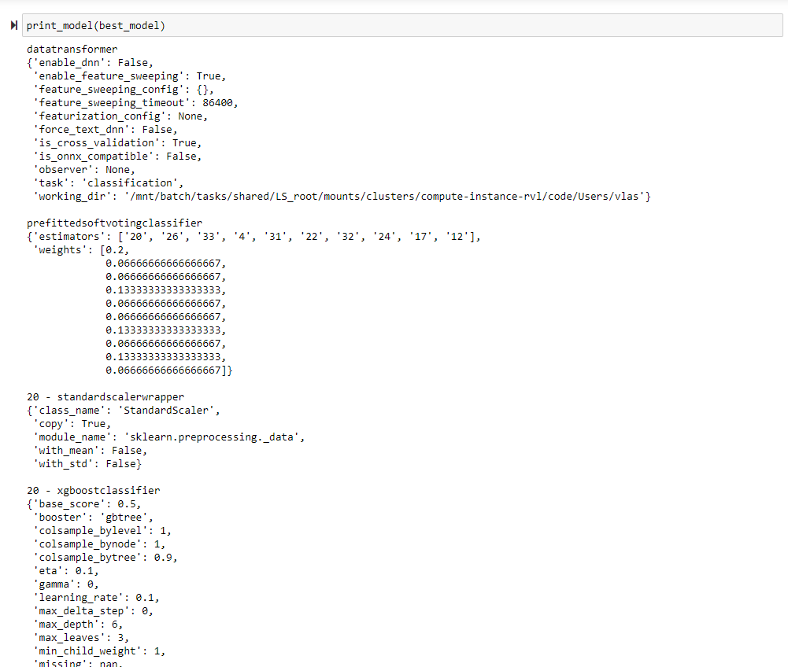
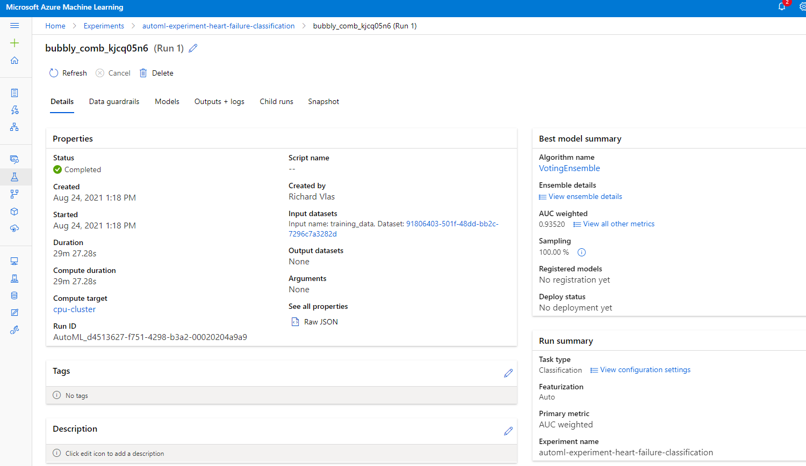

# Capstone Project: Azure Machine Learning Engineer

This project consists of two part: first part will be using Automated ML (denoted as AutoML) and the second part will use customized model whose hyperparameters are tuned using HyperDrive. The model trained by AutoML will be later on deployed and could be used as a ML service with which we can interact using REST API.

We will use an external dataset to train the model to classify heart failure based on clinical records and we will levarege all the different tools available in the AzureML Studio to do so. Please see the next section for more details about the dataset used in this project.


## Dataset

### Overview
The dataset we will be using in this project is called *Heart failure clinical records Data Set* and is publicly available from UCI Machine Learning Repository. 

The dataset contains medical records of 299 patients who had heart failure, collected during their follow-up period, where each patient profile has 13 clinical features.

Here is a [link](https://archive.ics.uci.edu/ml/machine-learning-databases/00519/heart_failure_clinical_records_dataset.csv) to the data.  


### Task

The task we are concerned with is to predict if the patient deceased during the follow-up period. We will be using `DEATH_EVENT` column as the target and since this is a boolean variable, the task at hand is Binary Classification.


The 12 clinical input features and the target feature are as follows:

- age: age of the patient (years)
- anaemia: decrease of red blood cells or hemoglobin (boolean)
- high blood pressure: if the patient has hypertension (boolean)
- creatinine phosphokinase (CPK): level of the CPK enzyme in the blood (mcg/L)
- diabetes: if the patient has diabetes (boolean)
- ejection fraction: percentage of blood leaving the heart at each contraction (percentage)
- platelets: platelets in the blood (kiloplatelets/mL)
- sex: woman or man (binary)
- serum creatinine: level of serum creatinine in the blood (mg/dL)
- serum sodium: level of serum sodium in the blood (mEq/L)
- smoking: if the patient smokes or not (boolean)
- time: follow-up period (days)
- [target] death event: if the patient deceased during the follow-up period (boolean)


### Access
In the cell below, we write code to access the data that we will store and use on Azure:

```python
found = False
key = "Health-Failure"
description_text = "Health Failure dataset for mortality prediction"

dataset_url = "https://archive.ics.uci.edu/ml/machine-learning-databases/00519/heart_failure_clinical_records_dataset.csv"

if key in ws.datasets.keys():
    dataset = ws.datasets[key]
    print("The Dataset was found!")
else:
    # Create AML Dataset and register it into Workspace
    dataset = Dataset.Tabular.from_delimited_files(dataset_url)
    # Register Dataset in Workspace
    dataset = dataset.register(workspace=ws,
                               name=key,
                               description=description_text)

df = dataset.to_pandas_dataframe()
```

## Automated ML

In this part of the project we make a use of Microsoft Azure Cloud to configure a cloud-based machine learning model and consequently deploy it. We first create a compute target with the following setting: `vm_size="Standard_D2_V2"`, `min_nodes=0`, `max_nodes=4` and then train a set of machine learning models leveraging AutoML to automaticaly train and tune a them using given target metric. In this case the selected target metric is `AUC_weighted`. A datastore retrieved by `data_store = ws.get_default_datastore()` is used to upload the dataset used to train the ML model and it is registered by using the following command  

```python
# Create AML Dataset and register it into Workspace
dataset = Dataset.Tabular.from_delimited_files(dataset_url)
# Register Dataset in Workspace
dataset = dataset.register(workspace=ws,
                           name=key,
                           description=description_text)
```

Once the AutoML experiment is completed, we then select the best model in terms of `AUC_weighted` out of all models trained and deploy it using Azure Container Instance (ACI). The model can now be consumed via a REST API.


### Results

The best performing model trained by AutoML was `VotingEnsemble` with `AUC_weighted = 0.935` as can be seen in the screenshot below.

Few parameters of its inner estimators are shown as well as its individual weights used to aggregate the estimators and integers designating the different estimators used in the Ensemble. For more comprehensive details please see [this](automl.ipynb) notebook.




**Best model in Azure Portal**



**RunDetails widget**


## Hyperparameter Tuning

In this section I have used a custom-coded model — a standard Scikit-learn Logistic Regression - which hyperparameters I optimized using HyperDrive.

Logistic regression, despite its name, is a linear model for classification rather than regression. Logistic regression is also known in the literature as logit regression, maximum-entropy classification (MaxEnt) or the log-linear classifier. In this model, the probabilities describing the possible outcomes of a single trial are modeled using a logistic function.

A Hyperdrive run is used to sweep over model parameters. The following steps are part of the process:

- Data preprocessing
- Splitting data into train and test sets
- Setting logistic regression parameters:
    - --C - Inverse of regularization strength
    - --max_iter - Maximum number of iterations convergence
- Azure Cloud resources configuration
- Creating a HyperDrive configuration using the estimator, hyperparameter sampler, and policy
- Retrieve the best run and save the model from that run

**RandomParameterSampling** 

Defines random sampling over a hyperparameter search space. In this sampling algorithm, parameter values are chosen from a set of discrete values or a distribution over a continuous range. This has an advantage against GridSearch method that runs all combinations of parameters and requires large amount of time to run.

For the Inverse of regularization strenght parameter I have chosen uniform distribution with min=0.0001 and max=1.0 For the Maximum number of iterations convergence I inputed a range of values (5, 25, 50, 100, 200, 500, 1000)

**BanditPolicy** 

Class Defines an early termination policy based on slack criteria, and a frequency and delay interval for evaluation. This greatly helps to ensure if model with given parameters is not performing well, it is turned down instead of running it for any longer.

### Results
The best model given by HyperDrive resulted in training accuracy of **0.92%**. The hyperparameters of the model are as follows:

- --C = **0.544**
- --max_iter = **25**

**Improvement**
- One way to improve the result could be to change the range of hyperparameters to extend the search space.
- Other ways include changing the ML model completely or use a data set with much more data records if that would be a posibility


### Screenshots

**RunDetails widget**


**Best model**


## Model Deployment

Here we use the best ML model from AutoML experiment and deploy it using Azure Container Instance (ACI). The model can be consumed via a REST API.

We also included file containing the environment details `myenv.yml` to ensure reproducibility.

To query the endpoint we use a 3 samples from the dataset so that we can evaluate whether the model performed well on the input data and retured the right prediction

Here is a code snipet with a sample input we used to make a request to the model: 

```python
# 3 sets of data to score, so we get two results back
data_df = test_df.sample(n=3)
labels = data_df.pop('DEATH_EVENT')

# Convert to JSON string
input_data = json.dumps({"data": data_df.to_dict(orient='records')})

# Make the request and display the response
resp = requests.post(scoring_uri, input_data, headers=headers)
print(resp.json())
```

**Active Endpoint**


## Screen Recording

This [screencast](https://youtu.be/4iQA2nbgB44) shows the entire process of the working ML application and it demonstrates:

- A working model
- Demo of the deployed  model
- Demo of a sample request sent to the endpoint and its response

